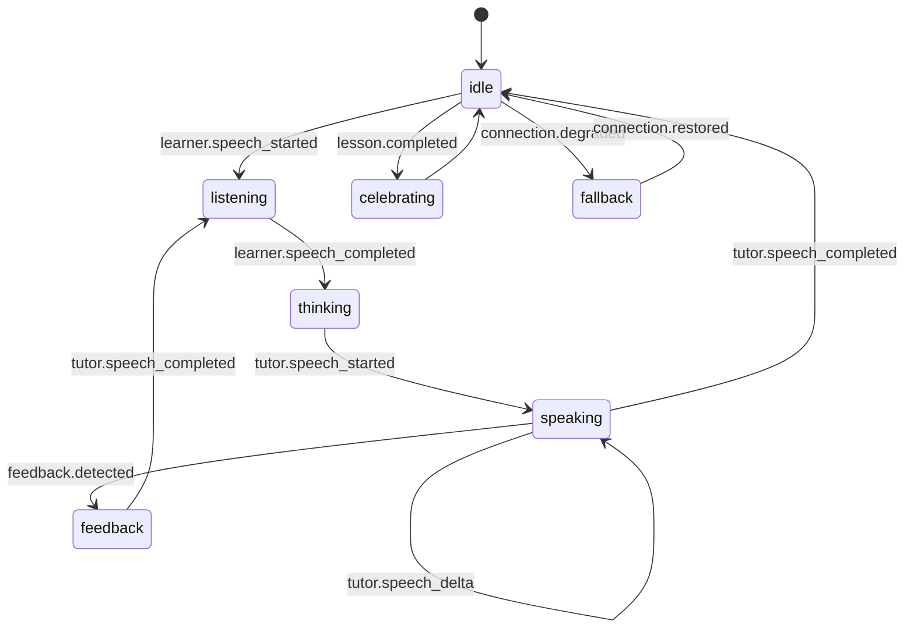

# Live Avatar Event Contract

## Purpose

The live avatar must react to voice-lesson events without becoming a hard dependency for the lesson. Voice tutoring, progress awards, and curriculum selection stay functional if avatar rendering fails.

## Event Sources

The Realtime tutor and lesson runtime may emit these normalized events:

| Event | Meaning | Avatar intent |
| --- | --- | --- |
| `lesson.ready` | Lesson plan and tutor instructions are loaded. | Friendly greeting or idle pose. |
| `learner.speech_started` | Learner starts speaking. | Listening posture. |
| `learner.speech_completed` | Learner turn is complete. | Thinking posture. |
| `tutor.speech_started` | Tutor starts speaking. | Speaking posture with neutral expression. |
| `tutor.speech_delta` | Tutor speech text/audio is streaming. | Optional viseme or mouth movement update. |
| `tutor.speech_completed` | Tutor finishes speaking. | Return to idle or listening. |
| `feedback.detected` | Tutor correction or praise is available. | Supportive expression or celebration. |
| `lesson.completed` | Lesson completion is verified. | Celebration gesture. |
| `connection.degraded` | Voice/avatar provider is unstable. | Non-blocking fallback state. |

## Avatar Action Envelope

Every avatar action should use this provider-neutral shape:

```json
{
  "type": "avatar.action",
  "attemptId": "uuid-or-runtime-attempt-id",
  "lessonPlanSlug": "raio-a1-linking",
  "occurredAt": "2026-05-23T00:00:00Z",
  "action": {
    "kind": "speak",
    "intensity": "medium",
    "durationMs": 1200,
    "emotion": "supportive",
    "text": "Great job linking those words."
  }
}
```

Allowed `action.kind` values:

- `idle`
- `listen`
- `think`
- `speak`
- `gesture`
- `expression`
- `celebrate`
- `fallback`

Allowed `intensity` values: `low`, `medium`, `high`.

## State Machine



## Safety and Privacy Invariants

- Avatar failure must never interrupt the voice lesson.
- The avatar must not receive raw learner audio.
- The avatar must not invent lesson content outside the tutor or curriculum event stream.
- The browser may render avatar actions, but provider credentials stay server-side.
- Avatar actions should be derived from safe lesson events, not from arbitrary client commands.
- A static avatar fallback must be valid for every lesson state.

## Latency Budget

| Interaction | Target |
| --- | --- |
| Listening/thinking/speaking state changes | Under 150 ms after local event receipt |
| Expression or gesture updates | Under 300 ms after event receipt |
| Viseme/mouth updates | Best effort; provider spike required |
| Fallback activation | Under 500 ms after provider failure detection |

## Deferred Implementation Decisions

- Avatar provider selection.
- Whether visemes are generated client-side or by the provider.
- Whether avatar actions need a Go endpoint or can flow through the existing lesson websocket/session channel.
- How Next.js forwards attempt, lesson, and session context to avatar rendering.

## Acceptance Scenarios

### Scenario: avatar greets when lesson is ready

Given a loaded RAIO lesson plan, when `lesson.ready` is emitted, then the avatar may show a greeting gesture without blocking voice setup.

### Scenario: avatar listens while learner speaks

Given the learner starts speaking, when `learner.speech_started` is emitted, then the avatar enters `listen` state and no audio is sent to the avatar provider.

### Scenario: avatar speaks with tutor output

Given the tutor response starts, when `tutor.speech_started` and `tutor.speech_delta` are emitted, then the avatar enters `speak` state using tutor-approved text/audio only.

### Scenario: avatar failure does not break the lesson

Given the avatar provider fails, when `connection.degraded` is emitted, then the lesson continues and the UI falls back to a static avatar state.
